<!-- omit from toc -->
# Tekoälyn suunnittelumalleja.md

Tähän tiedostoon on koottu jokainen kuvassa esiintyvä tekoälyn suunnittelumalli omana mermaid-kaavionaan. Jokaisessa mallissa on:

- **Kuvaus**: Mitä malli tekee
- **Ohje (milloin käyttää)**: Millaisissa tilanteissa/tehtävissä malli on hyödyllinen
- **Esimerkki**: Lyhyt käytännön **Esimerkki**
- **Mermaid-kaavio**: Kopioitava koodilohko


<!-- omit from toc -->
## Sisällysluettelo

- [1. Node (Single Step)](#1-node-single-step)
- [2. Flow (Multiple Steps)](#2-flow-multiple-steps)
- [3. Shared (Communication)](#3-shared-communication)
- [4. Branch (Conditional step)](#4-branch-conditional-step)
- [5. Batch (Repeat steps)](#5-batch-repeat-steps)
- [6. Async (I/O Wait)](#6-async-io-wait)
- [7. Parallel (Concurrent steps)](#7-parallel-concurrent-steps)
- [8. Looping (Long running step)](#8-looping-long-running-step)
- [9. Nesting (Reusable step)](#9-nesting-reusable-step)
- [10. Workflow (Directed Path)](#10-workflow-directed-path)
- [11. CoT (Chain-of-Thought)](#11-cot-chain-of-thought)
- [12. Chat (Looping + chat history store)](#12-chat-looping--chat-history-store)
- [13. RAG (Retrieval-Augmented Generation)](#13-rag-retrieval-augmented-generation)
- [14. Map-Reduce (Batch + Merge)](#14-map-reduce-batch--merge)
- [15. Chat Memory (Looping + history \& vector DB)](#15-chat-memory-looping--history--vector-db)
- [16. Agent (Looping + Branching)](#16-agent-looping--branching)
- [17. Multi-Agent (Loop + Branching + pub/sub)](#17-multi-agent-loop--branching--pubsub)
- [18. Supervisor (Nesting, Approve/Reject)](#18-supervisor-nesting-approvereject)
- [19 Multi-Agent Collaboration](#19-multi-agent-collaboration)
- [20 Tool-Driven Agent](#20-tool-driven-agent)
- [21 Self-Feedback Loop (Self-Check / Self-Correction)](#21-self-feedback-loop-self-check--self-correction)
- [22 Plan-and-Execute -malli](#22-plan-and-execute--malli)
- [23 Chat Memory + Persistent Storage](#23-chat-memory--persistent-storage)
- [24 Multi-Role "Self-Play"](#24-multi-role-self-play)
- [25 AutoTDD (Test-Driven Development -tyyli)](#25-autotdd-test-driven-development--tyyli)
- [26 CodeReview Agent](#26-codereview-agent)
- [27 Summarization/Documentation Pipeline](#27-summarizationdocumentation-pipeline)
- [28 Conversation Logging \& Replay](#28-conversation-logging--replay)
- [29 Custom Agents](#29-custom-agents)
- [30 Selector Group Chat](#30-selector-group-chat)
- [31 Swarm](#31-swarm)
- [31 Magentic-One](#31-magentic-one)
- [32 Memory and RAG](#32-memory-and-rag)
- [33 Logging](#33-logging)
- [34 Serializing Components](#34-serializing-components)
- [35 Tracing and Observability](#35-tracing-and-observability)
- [36 Human-in-the-Loop](#36-human-in-the-loop)

---

## 1. Node (Single Step)

**Kuvaus**  
Yksittäinen askel, joka toteuttaa yhden pienen, rajatun tehtävän (esim. "Summarize Email").

**Ohje (milloin käyttää)**  
Yksi funktio/toimenpide ilman laajempaa työnkulkua.

**Esimerkki**  
Yksittäinen vaihe, joka lukee sähköpostin ja tuottaa tiivistelmän.

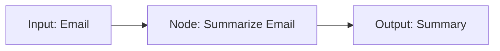


## 2. Flow (Multiple Steps)

**Kuvaus**
Usean peräkkäisen askeleen ketju, jossa jokainen vaihe syöttää tuloksensa seuraavalle askeleelle.

**Ohje (milloin käyttää)**
Kun tehtävä koostuu useista loogisista vaiheista, jotka suoritetaan järjestyksessä.

**Esimerkki**
	1.	Summarize Email
	2.	Draft Reply
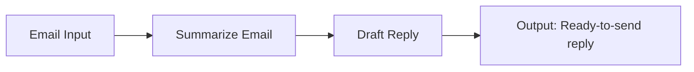


## 3. Shared (Communication)

**Kuvaus**
Kaksi tai useampi askelta, jotka jakavat samaa dataa/muistia (read/write).

**Ohje (milloin käyttää)**
Kun halutaan tallentaa ja lukea yhteistä tilaa (esim. "Email Summary").

**Esimerkki**
	1.	Summarize Email kirjoittaa tiivistelmän
	2.	Draft Reply lukee saman tiivistelmän ja laatii vastauksen

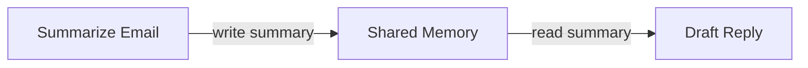


## 4. Branch (Conditional step)

**Kuvaus**
Ehdollinen haara, joka ohjaa työnkulkua tuloksen perusteella eri suuntiin.

**Ohje (milloin käyttää)**
Kun prosessi voi kulkea eri polkuja (esim. "Tarvitaanko ulkopuolista hyväksyntää?").

**Esimerkki**
Summarize Email -> Tarkista "Need Review?" -> Jos kyllä, "Review"; muuten "Draft Reply"

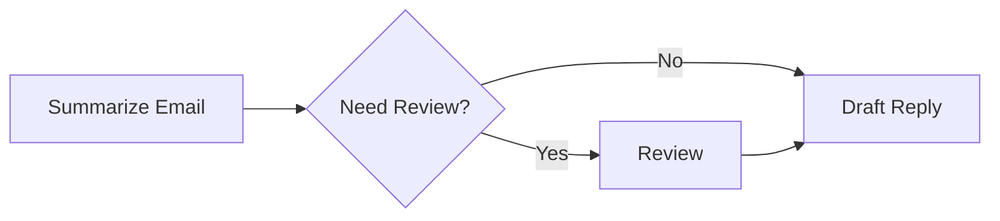


## 5. Batch (Repeat steps)

**Kuvaus**
Sama tehtävä toistetaan useille syötteille (esim. useille sähköposteille).

**Ohje (milloin käyttää)**
Kun pitää käsitellä monta samanlaista kohdetta (luuppi).

**Esimerkki**
Tiivistä jokainen sähköposti erikseen käyttäen samaa "Summarize Email" -toimintoa.

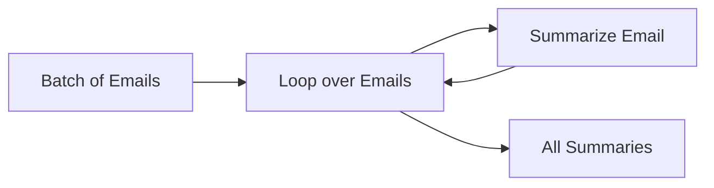


## 6. Async (I/O Wait)

**Kuvaus**
Asynkroninen vaihe, jossa odotetaan ulkoista tapahtumaa ennen jatkamista.

**Ohje (milloin käyttää)**
Kun työnkulussa on vaihe, joka ei voi edetä ennen ulkoista tuloa (esim. "Odota käyttäjän vastausta" tai "Odota uusia viestejä").

**Esimerkki**
Check Inbox (wait) -> Jos uusia viestejä tulee, Summarize Email.

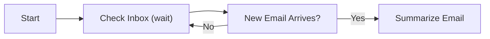


## 7. Parallel (Concurrent steps)

**Kuvaus**
Useita askeleita suoritetaan rinnakkain yhtä aikaa.

**Ohje (milloin käyttää)**
Kun tehtävän osat ovat toisistaan riippumattomia ja voidaan ajaa samanaikaisesti.

**Esimerkki**
Summarize Email ja Analyze Sentiment rinnakkain.

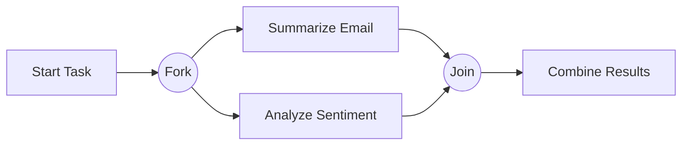


## 8. Looping (Long running step)

**Kuvaus**
Toistuva silmukka, jossa jokin askel toistetaan yhä uudelleen, kunnes ehto täyttyy.

**Ohje (milloin käyttää)**
Kun halutaan iteratiivinen prosessi (esim. "Kysy uudestaan, kunnes vastaus on hyvä").

**Esimerkki**
Get Question -> Answer Question -> Kysy "OK?" -> jos ei, palaa alkuun.

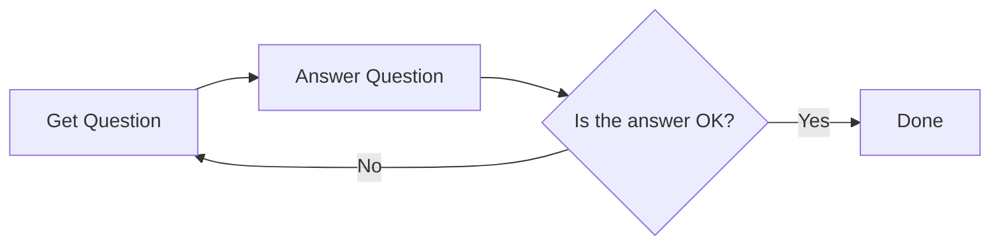


## 9. Nesting (Reusable step)

**Kuvaus**
Alimoduuli, jota voidaan kutsua useaan kertaan prosessissa.

**Ohje (milloin käyttää)**
Kun jokin tehtävä (esim. "Cooling Task") halutaan erottaa omaksi kokonaisuudeksi.

**Esimerkki**
"Cooling Task" sisältää vaiheet "Write tests", "Analyze Complexity", "Write codes", "Verify codes".

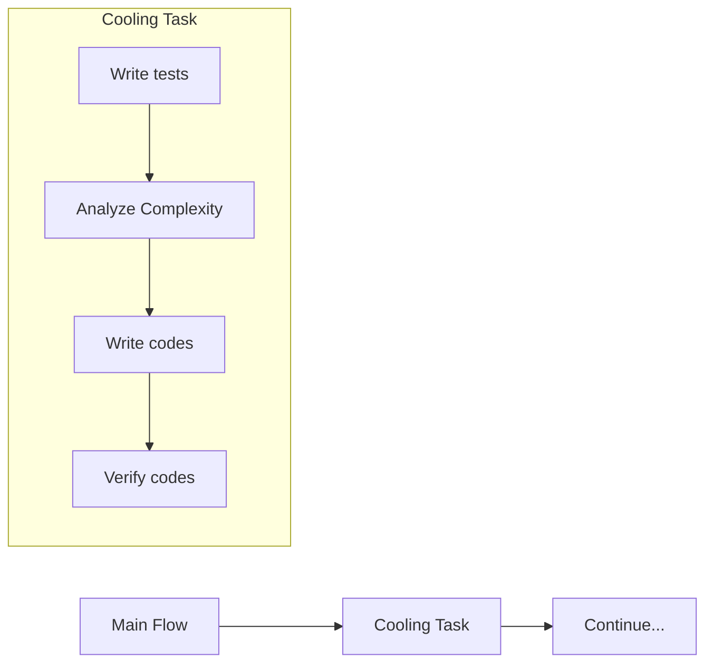


## 10. Workflow (Directed Path)

**Kuvaus**
Ohjattu polku, jossa tehtävät suoritetaan lineaarisesti määritellyssä järjestyksessä.

**Ohje (milloin käyttää)**
Kun halutaan selkeä ja suoraviivainen alku-loppu -prosessi.

**Esimerkki**
	1.	Summarize Email -> 2) Draft Reply -> 3) Send Reply

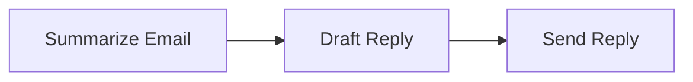


## 11. CoT (Chain-of-Thought)

**Kuvaus**
Mallin "ajatusketju" tai välivaiheet, joissa se "pohtii" ennen lopullista vastausta.

**Ohje (milloin käyttää)**
Monimutkaisessa päättelyssä, jossa tarvitaan väliaskelia.

**Esimerkki**
	1.	Think -> 2) Tallennetaan think history -> 3) Final Answer

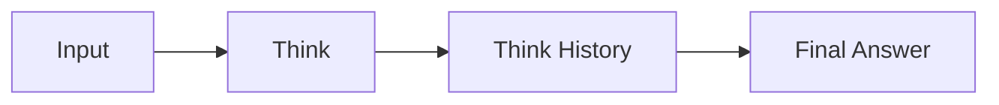


## 12. Chat (Looping + chat history store)

**Kuvaus**
Chat-pohjainen vuorovaikutus, jossa viestit tallennetaan keskusteluhistoriaan, ja jokainen askel hyödyntää aiempia viestejä.

**Ohje (milloin käyttää)**
Kun toteutetaan keskustelullinen käyttöliittymä (chat) – jokaisella uudella viestillä on historia.

**Esimerkki**
	1.	User Message -> 2) Chat Step -> 3) Chat History

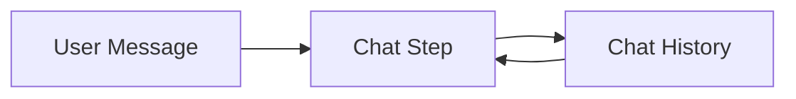


## 13. RAG (Retrieval-Augmented Generation)

**Kuvaus**
Mallille annetaan ulkoista tietoa (kuten dokumenttivarasto) vastauksen parantamiseksi.

**Ohje (milloin käyttää)**
Kun halutaan parantaa mallin vastauksia olemassa olevan tietokannan avulla.

**Esimerkki**
	1.	Search Vector DB -> 2) Retrieve Relevant Docs -> 3) Generate Final Answer

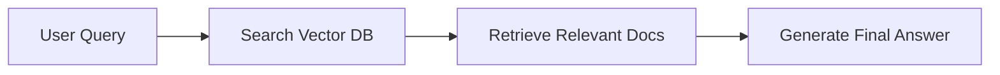


## 14. Map-Reduce (Batch + Merge)

**Kuvaus**
Data pilkotaan pieniin osiin (Map), käsitellään, ja tulokset yhdistetään lopuksi (Reduce).

**Ohje (milloin käyttää)**
Sopii suuren tietomassan rinnakkaiseen käsittelyyn (esim. iso dokumentti palasiksi).

**Esimerkki**
Jaa dokumentti osiin -> Summarize jokainen osa -> Yhdistä yhdeksi tiivistelmäksi.

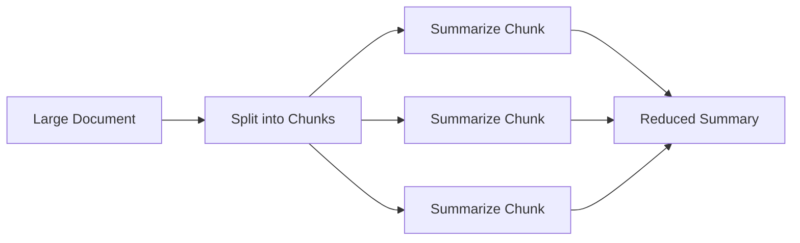


## 15. Chat Memory (Looping + history & vector DB)

**Kuvaus**
Chat-järjestelmä, joka tallentaa jokaisen vuorovaikutuksen paitsi perinteiseen historiaan, myös vektoripohjaiseen kantaan.

**Ohje (milloin käyttää)**
Kun halutaan pitkäkestoista ja älykästä chat-hakua (keskusteluhistorian semanttinen haku).

**Esimerkki**
	1.	Käyttäjän viesti tallentuu chat-historiaan
	2.	Samalla tallennetaan vektori-indeksiin -> helpottaa myöhempää hakua

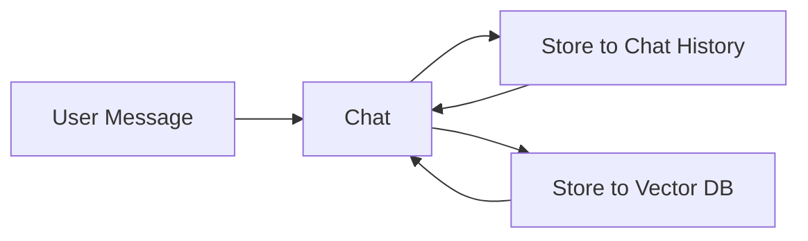


## 16. Agent (Looping + Branching)

**Kuvaus**
Agentti, joka iteroi tehtävää (esim. Summarize Email) ja haarautuu päätösten perusteella (Need review? Approve?).

**Ohje (milloin käyttää)**
Kun halutaan dynaaminen prosessi, jossa agentti tekee päätöksiä ja palaa tarvittaessa taaksepäin.

**Esimerkki**
	1.	Summarize Email -> 2) Tarvitseeko review? -> 3) Jos ei ok, palaa summarizointiin.

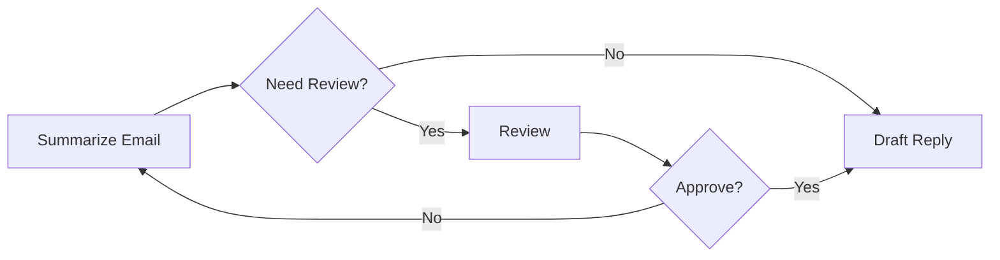


## 17. Multi-Agent (Loop + Branching + pub/sub)

**Kuvaus**
Useita samanaikaisia tai peräkkäisiä agentteja, jotka viestivät toistensa kanssa (publish/subscribe).

**Ohje (milloin käyttää)**
Kun halutaan hajauttaa tehtäviä erikoistuneille agenteille, jotka "kuuntelevat" viestejä ja "julkaisevat" omia.

**Esimerkki**
Agentti A hakee dataa -> julkaisee -> Agentti B lukee -> laatii raportin -> Agentti C lukee -> kommentoi

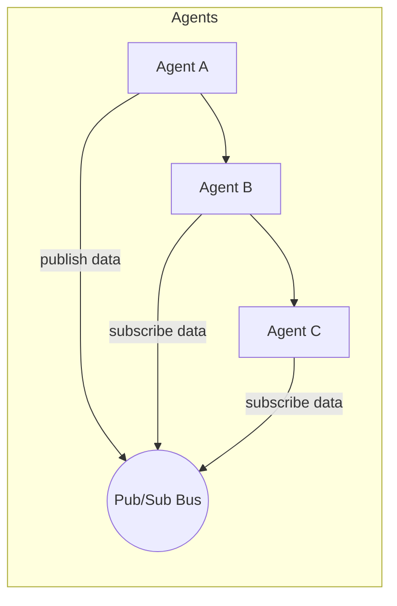


## 18. Supervisor (Nesting, Approve/Reject)

**Kuvaus**
"Meta-agentti" tai valvoja, joka kutsuu useita tehtäviä ja lopuksi hyväksyy tai hylkää niiden tulokset.

**Ohje (milloin käyttää)**
Kun tarvitaan päättävä taho koko prosessin ylle, joka arvioi osatulokset.

**Esimerkki**
Supervisor -> Summarize Email -> Draft Reply -> Lopullinen Approve/Reject

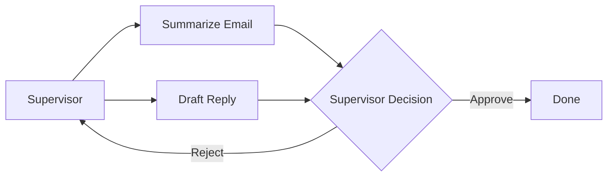


## 19 Multi-Agent Collaboration

**Kuvaus**
Useita agentteja (esim. eri roolit: "AssistantAgent", "UserProxyAgent") jotka keskustelevat keskenään suorittaakseen monimutkaisia tehtäviä. Autogen tarjoaa helpon tavan käynnistää useita agentteja ja hallita niiden vuorovaikutusta.

**Ohje (milloin käyttää)**
	•	Kun halutaan hajauttaa tehtävää useammalle roolille (esim. koodin kirjoittaja, koodin tarkastaja).
	•	Kun yksi agentti tuottaa tekstiä/koodia ja toinen arvioi tai täydentää sitä.

**Esimerkki**
	•	Agentti A: "Koodaa minulle funktion X"
	•	Agentti B: "Tarkista onko koodi syntaksiltaan oikein, testaa se."
> **Huom:** Voit tallentaa yllä olevan tekstin sellaisenaan `.md`-tiedostona, jonka voit avata tai jakaa eteenpäin.  

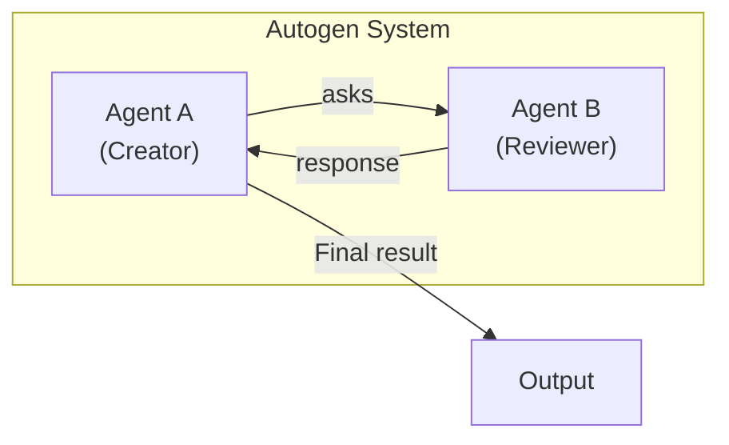


## 20 Tool-Driven Agent

**Kuvaus**
Agentti (LLM) voi kutsua ulkoisia työkaluja (funktioita, API-pyyntöjä, tiedostojärjestelmää), kun se tarvitsee lisätietoa tai suorittaa tehtävänsä. Autogen abstrahoi nämä "tool" kutsut selkeäksi rajapinnaksi.

**Ohje (milloin käyttää)**
	•	Kun agentilla on tarve käyttää ohjelman sisäisiä funktioita, kolmannen osapuolen kirjastoja tai API-rajapintoja.
	•	Kun halutaan laajentaa LLM:n kyvykkyyttä reaalimaailman toimenpiteisiin.

**Esimerkki**
	•	Agentti: "Hae tämän userID:n tiedot tietokannasta, sitten laadi raportti."
	•	Työkalu: fetch_user_data(userID)

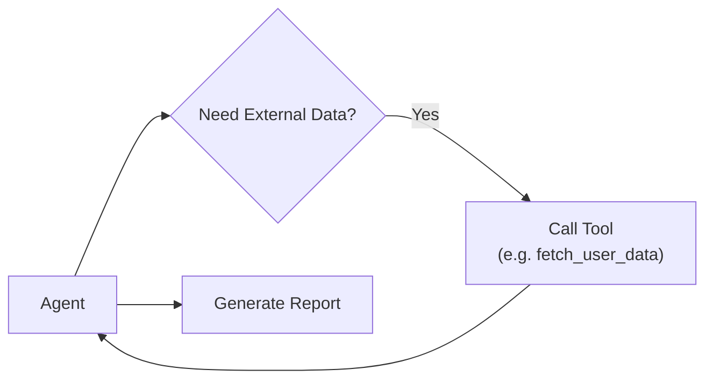


## 21 Self-Feedback Loop (Self-Check / Self-Correction)

**Kuvaus**
Sama agentti tuottaa ensin luonnoksen, lukee sen "kriittisenä arvioijana" ja korjaa mahdolliset virheet. Autogen mahdollistaa tämän "itsepalautteen" rakenteen, jossa agentti ikään kuin testaa omaa tuotostaan.

**Ohje (milloin käyttää)**
	•	Kun tarvitaan automaattinen laaduntarkastus: agentti arvioi ensin itse vastaustaan ennen kuin se päätyy lopulliseen tulokseen.
	•	Esimerkiksi koodia generoitaessa: agentti generoi koodin, testaa sen tai käy läpi loogisia tarkistuksia, tekee korjauksia.

**Esimerkki**
	•	Agentti laatii Python-funktion, sitten agentti itse suorittaa "lint" - tai testiskenaarion, huomaa virheitä ja palaa korjaamaan ne.

```mermaid
flowchart LR
    A[Draft Output] --> B[Self-Check]
    B --> C{Errors?}
    C -- Yes --> A
    C -- No --> D[Final Output]
```


## 22 Plan-and-Execute -malli

**Kuvaus**
Agentti laatii ensin korkean tason suunnitelman ("plan"), jonka pohjalta se suorittaa vaiheittain osatehtäviä (joihin voi sisältyä "tool" kutsuja, kysymyksiä toiselle agentille tai sisäistä pohdintaa).

**Ohje (milloin käyttää)**
	•	Kun tehtävä on monimutkainen ja kannattaa ensin selventää vaiheet, ennen kuin aletaan tuottaa lopullista ratkaisua.
	•	Esim. iso projekti: "Laadi koodi, testit ja dokumentaatio."

**Esimerkki**
	•	Agentti: "Suunnitellaan 1) Tietorakenne, 2) Metodit, 3) Testit, 4) Dokumentaatio."
	•	Sitten se käy vaiheet läpi yksi kerrallaan.

```mermaid
flowchart LR
    A[Initial Request] --> B[Create Plan]
    B --> C[Execute Step 1]
    C --> D[Execute Step 2]
    D --> E[Execute Step 3]
    E --> F[Final Output]
```


## 23 Chat Memory + Persistent Storage

**Kuvaus**
Agenttien viestit tallentuvat keskusteluhistoriaan ja/tai pysyvään talletukseen (tiedosto-/vektorikanta). Autogen mahdollistaa "muistin" ja "kontekstin" säilyttämisen pidempään, esim. monen vuorovaikutuksen yli.

**Ohje (milloin käyttää)**
	•	Pitkäkestoiset projektit: agentti muistaa aiemmin saadun palautteen tai valintoja.
	•	Useamman "sessio" -tyylin rakentaminen, missä menneet viestit vaikuttavat tuleviin.

**Esimerkki**
	•	Agentti käy pitkiä neuvotteluja, jokainen viesti lisätään kontekstiin. Myöhemmin agentti voi hakea muistista aiemmin sovittuja asioita.

```mermaid
flowchart LR
    A[User/Agent Message] --> B[Autogen Chat]
    B --> C[Persist to<br>Storage/DB]
    C --> B
    B --> D[Next Response]
```


## 24 Multi-Role "Self-Play"

**Kuvaus**
Sama fyysinen LLM-pohjainen agentti voi toteuttaa useita "rooleja", ikään kuin se puhuisi itsensä kanssa eri hatuilla (esim. "Koodaaja" vs. "Arvostelija"). Autogen sujuvoittaa näiden roolien kytkemistä keskenään.

**Ohje (milloin käyttää)**
	•	Kun halutaan ideoiden "sparrausta" ilman erillistä ihmiskäyttäjää: LLM voi generoida ideoita toisessa roolissa ja arvioida niitä toisessa.
	•	Esim. "Rooleina Designer & Critic."

**Esimerkki**
	•	Designer: "Tässä on koodin runko..."
	•	Critic: "Huomioi reunatapaukset ja laadi testit."
	•	Designer: "Korjasin koodin..."
	•	Critic: "OK, hyväksytty."

```mermaid
flowchart LR
    subgraph Self-Play
    A[Designer Role] -- propose code --> B[Critic Role]
    B -- feedback --> A
    end

    A --> C[Final Approved Code]
```


## 25 AutoTDD (Test-Driven Development -tyyli)

**Kuvaus**
Autogen-projektissa on ideoita, joissa agentti ensin generoi testit, sitten koodin, sitten ajaa testit, ja toistaa kierrosta kunnes testit menevät läpi.

**Ohje (milloin käyttää)**
	•	Kun halutaan tuottaa koodia mahdollisimman virheettömästi ja iteratiivisesti.
	•	Agentti itse generoi testit: "Kirjoita testit ensin," ja vasta sitten tuottaa koodia.

**Esimerkki**
	•	Agentti laatii testin X_test.py, ajaa testit, huomaa virheen, korjaa koodin, kunnes testi läpäistään.

```mermaid
flowchart LR
    A[Generate Tests] --> B[Generate Code]
    B --> C[Run Tests]
    C --> D{All Passed?}
    D -- No --> B
    D -- Yes --> E[Done]
```


## 26 CodeReview Agent

**Kuvaus**
Projektissa voidaan automatisoida "pull request" -tyylinen koodikatselmointi: Agentti tuottaa koodin, toinen agentti (tai sama agentti eri roolissa) arvioi sen, ja joko hyväksyy tai ehdottaa muutoksia.

**Ohje (milloin käyttää)**
	•	Kun halutaan simuloida PR-käytäntöjä: "Luo feature-luokka," "Tee code review," "Vaadi tiettyjen kriteerien täyttymistä."

**Esimerkki**
	•	AssistantAgent: "Tässä feature-luokka."
	•	ReviewerAgent: "Hyväksyn, mutta huomioi vielä testit."
	•	AssistantAgent: "Lisäsin testit. OK?"
	•	ReviewerAgent: "Hyväksyn."

```mermaid
flowchart LR
    A[AssistantAgent<br>creates code] --> B[ReviewerAgent]
    B --> C{Approve?}
    C -- No --> A
    C -- Yes --> D[Merge / Done]
```


## 27 Summarization/Documentation Pipeline

**Kuvaus**
Agentti generoi dokumentaatiota suoraan koodipohjasta tai keskeneräistä ideointia "ydin->dokumentaatio->tiivistelmät" -tyyliin. Autogen tarjoaa keinoja kytkeä dokumentointikyselyt samaan "keskustelusilmukkaan."

**Ohje (milloin käyttää)**
	•	Kun halutaan automaattisesti tuottaa dokumentaatiota projektin lomassa.
	•	Esim. iso kooditiedosto -> agentti tuottaa automaattisesti README.md -sisällön.

**Esimerkki**
	•	"Kuvaile tämän Python-luokan vastuut, metodien parametrit ja esimerkkikäyttö."

```mermaid
flowchart LR
    A[Source Code] --> B[Doc Agent]
    B --> C[Generate Docs]
    C --> D[Summaries/README]
```


## 28 Conversation Logging & Replay

**Kuvaus**
Autogen tallentaa (tai mahdollistaa tallentamisen) jokaisen vuorovaikutuksen, jotta niitä voi myöhemmin toistaa, tarkistaa, ja debugata. "Replay" auttaa ymmärtämään, miksi agentti päätyi tiettyyn lopputulokseen.

**Ohje (milloin käyttää)**
	•	Kun halutaan varmistaa toistettavuus: pystytään toistamaan sama "keskustelu" T-hetkellä, jos halutaan selvittää bugi.
	•	Kun agentin toimintaa halutaan seurata ja auditoida jälkeenpäin.

**Esimerkki**
	•	Päiväkirjatyyppinen logitus: "Agentti 9.4.2025 klo 12:13, pyysi Tool X:ää."
	•	Myöhemmin: "Katsotaan muistiinpanoista miksi agentti teki päätöksen Y."

```mermaid
flowchart LR
    A[Agent Conversation] --> B[Logging Service]
    B --> C[Stored Logs]
    C --> D[Replay / Debug Session]
```


## 29 Custom Agents

**Description:**  
Custom Agents are user-defined agents with tailored behaviors and functionalities beyond the default agents provided by AutoGen.

**When to Use:**  
Utilize Custom Agents when the default agents do not meet specific requirements or when implementing specialized tasks requiring unique behaviors. [oai_citation_attribution:4‡Microsoft](https://microsoft.github.io/autogen/dev/user-guide/agentchat-user-guide/index.html?utm_source=chatgpt.com)

**Example Scenario:**  
Creating an agent that interacts with a proprietary API to fetch data not accessible through standard agents.

**Mermaid Diagram:**
```mermaid
flowchart LR
    A[User Input] --> B[Custom Agent]
    B --> C[Proprietary API]
    C --> D[Fetch Data]
    D --> E[Process Data]
    E --> F[Output Result]
```


## 30 Selector Group Chat

**Description:**
Selector Group Chat is a team setup where agents take turns broadcasting messages to all other members. A model selects the next speaker based on the shared context, enabling dynamic, context-aware collaboration. 

**When to Use:**
Use Selector Group Chat when multiple agents need to collaborate dynamically, and the conversation flow should be determined based on the context of the discussion.

**Example Scenario:**
A team of agents working together to plan a trip, where each agent contributes based on their expertise (e.g., flights, hotels, activities). 

**Mermaid Diagram:**
```mermaid
flowchart LR
    A[Task Assigned] --> B[Agent 1]
    B --> C[Broadcast Message]
    C --> D[Agent 2]
    D --> E[Broadcast Message]
    E --> F[Agent 3]
    F --> G[Broadcast Message]
    G --> H[Task Completed]
```


## 31 Swarm

**Description:**
Swarm implements a team where agents can hand off tasks to other agents based on their capabilities. It allows agents to make local decisions about task planning without relying on a central orchestrator. 

**When to Use:**
Employ Swarm when building a decentralized system where agents autonomously delegate tasks to peers with the appropriate capabilities.

**Example Scenario:**
A customer support system where an initial agent assesses a query and hands it off to a specialized agent for resolution.

**Mermaid Diagram:**
```mermaid
flowchart LR
    A[Customer Query] --> B[General Support Agent]
    B --> C{Specialized Issue?}
    C -- Yes --> D[Specialist Agent]
    C -- No --> E[Resolve Issue]
    D --> F[Resolve Issue]
    E --> G[Provide Solution]
    F --> G
    G --> H[Customer Informed]
```


## 31 Magentic-One

**Description:**
Magentic-One is a generalist multi-agent system designed to solve open-ended web and file-based tasks across various domains. It uses an orchestrator agent to create plans, delegate tasks, and track progress. 

**When to Use:**
Utilize Magentic-One for complex tasks requiring coordination among multiple specialized agents, such as web navigation, file handling, and code execution.

**Example Scenario:**
An orchestrator agent delegates tasks to a FileSurfer agent for reading files, a WebSurfer agent for browsing the web, and a Coder agent for writing code to complete a complex project. 

**Mermaid Diagram:**
```mermaid
flowchart LR
    A[Orchestrator Agent] --> B[Create Plan]
    B --> C[Delegate to FileSurfer]
    C --> D[Read Files]
    D --> E[Update Progress]
    E --> F[Delegate to WebSurfer]
    F --> G[Browse Web]
    G --> H[Update Progress]
    H --> I[Delegate to Coder]
    I --> J[Write Code]
    J --> K[Update Progress]
    K --> L[Task Completed]
```


## 32 Memory and RAG

**Description:**
Memory and Retrieval-Augmented Generation (RAG) involve maintaining a store of useful facts that can be intelligently added to the agent's context before a specific step. 

**When to Use:**
Implement Memory and RAG when an agent needs to retrieve relevant information from a database to enhance its responses, such as in a chatbot remembering user preferences.

**Example Scenario:**
An agent retrieves a user's past interactions to provide personalized recommendations.

**Mermaid Diagram:**
```mermaid
    flowchart LR
    A[User Query] --> B[Retrieve Memory]
    B --> C[Relevant Information]
    C --> D[Enhance Context]
    D --> E[Generate Response]
    E --> F[Provide Answer]
```


## 33 Logging

**Description:**
Logging involves recording traces and internal messages to monitor and debug the behavior of agents and teams. 

**When to Use:**
Use Logging to keep track of agent interactions, decisions, and errors for debugging and analysis purposes.

**Example Scenario:**
Recording the sequence of actions taken by agents in a multi-agent system to identify bottlenecks or errors.

**Mermaid Diagram:**
```mermaid
flowchart LR
    A[Agent Action] --> B[Log Message]
    B --> C[Store Log]
    C --> D[Analyze Logs]
    D --> E[Debug System]
```


## 34 Serializing Components

**Kuvaus**
Serializing Components tarkoittaa AutoGenissa agenttien, tiimien tai työkalujen tallentamista ja lataamista määrittelytiedostojen (esim. JSON) avulla. Tällä tavoin komponenttien tilat tai asetukset voidaan säilyttää, siirtää tai rekonstruoida helposti eri ympäristöissä.

**Ohje (milloin käyttää)**
	•	Kun halutaan tallentaa agenttien tai tiimien konfiguraatioita myöhempää käyttöä tai jakoa varten.
	•	Kun tarvitaan johdonmukaisuutta eri ympäristöjen välillä tai halutaan jakaa asetuksia muille kehittäjille.

**Esimerkki**
	•	Luodaan agentti, tallennetaan sen asetukset JSON-muotoon (dump_component), jonka jälkeen agentti voidaan ladata toisessa ympäristössä takaisin käyttöön (load_component).


```mermaid
flowchart LR
    A[Agent/Team Instance] -->|dump_component()| B[JSON Specification]
    B -->|load_component()| C[Reconstructed Instance]
```

## 35 Tracing and Observability

**Kuvaus**
Tracing and Observability tarkoittaa AutoGenissa agenttien toiminnan yksityiskohtaista seurantaa OpenTelemetry-kehyksen avulla. Sen avulla voidaan tallentaa agenttien välisiä vuorovaikutuksia ja sisäisiä tapahtumia, jotka helpottavat vianmääritystä, suorituskyvyn analysointia sekä toiminnan ymmärtämistä.

**Ohje (milloin käyttää)**
	•	Kun halutaan yksityiskohtainen näkymä agenttien sisäiseen toimintaan ja viestinvälitykseen.
	•	Vianmäärityksessä ja tuotantoympäristöjen monitoroinnissa.

**Esimerkki**
	•	Agenttitiimi suorittaa tehtävää, ja OpenTelemetry tallentaa jokaisen agentin vuorovaikutuksen, kuten viestien lähettämiset ja vastaanotot. Tiedot kerätään esimerkiksi Jaeger-palveluun, jossa niitä voidaan visualisoida ja analysoida.

```mermaid
flowchart LR
    A[Agent Team Execution] --> B[OpenTelemetry Tracing]
    B --> C[Telemetry Backend (e.g. Jaeger)]
    C --> D[Visualization & Debugging]
```


## 36 Human-in-the-Loop

**Kuvaus**
Human-in-the-Loop tarkoittaa AutoGenissa ihmiskäyttäjän osallistumista agenttitiimin toimintaan joko tiimin suorituksen aikana tai eri suorituskertojen välissä. Näin ihmiskäyttäjä voi antaa palautetta, hyväksyä tai muokata agenttien päätöksiä ja ohjata toimintaa haluttuun suuntaan.

**Ohje (milloin käyttää)**
	•	Kun tarvitaan ihmisen hyväksyntää, päätöstä tai lisäohjeistusta agentin suorittamien tehtävien välillä.
	•	Tilanteissa, joissa on tärkeää valvoa ja tarvittaessa puuttua automaattisten päätösten tekemiseen.

**Esimerkki**
	•	Asiakastukiagentti ehdottaa ratkaisua ja jää odottamaan käyttäjän vahvistusta ennen seuraavan vaiheen suorittamista. Käyttäjän antama palaute ohjaa seuraavaa agentin toimintakierrosta.

```mermaid
flowchart LR
    A[Agentti suorittaa tehtävän] --> B[Odottaa käyttäjän palautetta]
    B --> C[Käyttäjän palaute/vahvistus]
    C --> A
```