# Tekoälyn suunnittelumalleja.md

Tähän tiedostoon on koottu jokainen kuvassa esiintyvä tekoälyn suunnittelumalli omana mermaid-kaavionaan. Jokaisessa mallissa on:

- **Kuvaus**: Mitä malli tekee
- **Ohje (milloin käyttää)**: Millaisissa tilanteissa/tehtävissä malli on hyödyllinen
- **Esimerkki**: Lyhyt käytännön Esimerkki
- **Mermaid-kaavio**: Kopioitava koodilohko

---

## 1. Node (Single Step)

**Kuvaus**  
Yksittäinen askel, joka toteuttaa yhden pienen, rajatun tehtävän (esim. “Summarize Email”).

**Ohje (milloin käyttää)**  
Yksi funktio/toimenpide ilman laajempaa työnkulkua.

**Esimerkki**  
Yksittäinen vaihe, joka lukee sähköpostin ja tuottaa tiivistelmän.

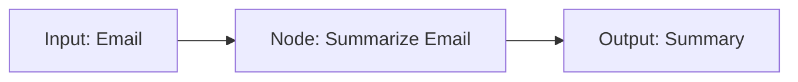

⸻

## 2. Flow (Multiple Steps)

**Kuvaus**
Usean peräkkäisen askeleen ketju, jossa jokainen vaihe syöttää tuloksensa seuraavalle askeleelle.

**Ohje (milloin käyttää)**
Kun tehtävä koostuu useista loogisista vaiheista, jotka suoritetaan järjestyksessä.

**Esimerkki**
	1.	Summarize Email
	2.	Draft Reply
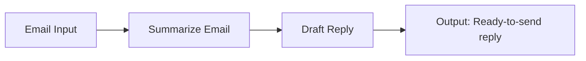


⸻

## 3. Shared (Communication)

**Kuvaus**
Kaksi tai useampi askelta, jotka jakavat samaa dataa/muistia (read/write).

**Ohje (milloin käyttää)**
Kun halutaan tallentaa ja lukea yhteistä tilaa (esim. “Email Summary”).

**Esimerkki**
	1.	Summarize Email kirjoittaa tiivistelmän
	2.	Draft Reply lukee saman tiivistelmän ja laatii vastauksen

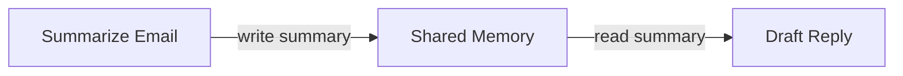


⸻

## 4. Branch (Conditional step)

**Kuvaus**
Ehdollinen haara, joka ohjaa työnkulkua tuloksen perusteella eri suuntiin.

**Ohje (milloin käyttää)**
Kun prosessi voi kulkea eri polkuja (esim. “Tarvitaanko ulkopuolista hyväksyntää?”).

**Esimerkki**
Summarize Email -> Tarkista “Need Review?” -> Jos kyllä, “Review”; muuten “Draft Reply”

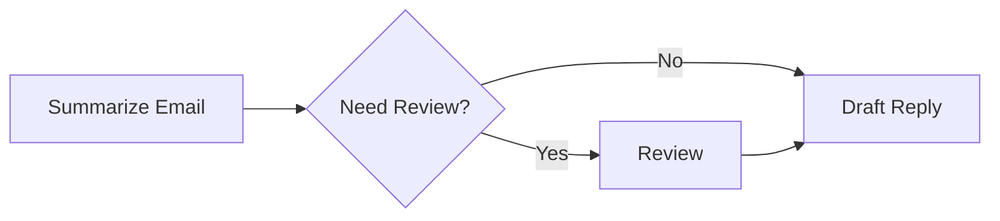


⸻

## 5. Batch (Repeat steps)

**Kuvaus**
Sama tehtävä toistetaan useille syötteille (esim. useille sähköposteille).

**Ohje (milloin käyttää)**
Kun pitää käsitellä monta samanlaista kohdetta (luuppi).

**Esimerkki**
Tiivistä jokainen sähköposti erikseen käyttäen samaa “Summarize Email” -toimintoa.

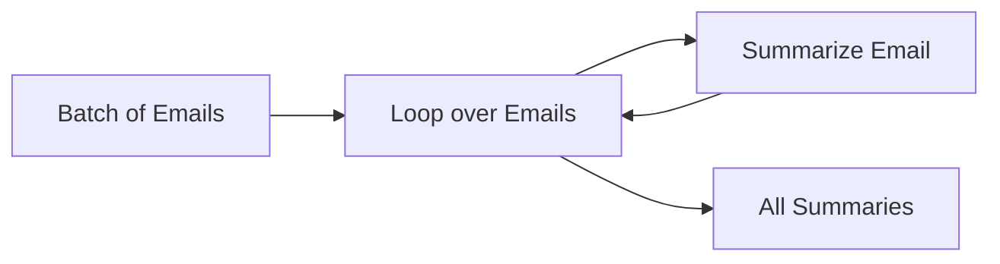


⸻

## 6. Async (I/O Wait)

**Kuvaus**
Asynkroninen vaihe, jossa odotetaan ulkoista tapahtumaa ennen jatkamista.

**Ohje (milloin käyttää)**
Kun työnkulussa on vaihe, joka ei voi edetä ennen ulkoista tuloa (esim. “Odota käyttäjän vastausta” tai “Odota uusia viestejä”).

**Esimerkki**
Check Inbox (wait) -> Jos uusia viestejä tulee, Summarize Email.

```mermaid
flowchart LR
    A[Start] --> B[Check Inbox (wait)]
    B --> C[New Email Arrives?]
    C -- Yes --> D[Summarize Email]
    C -- No --> B
```


⸻

## 7. Parallel (Concurrent steps)

**Kuvaus**
Useita askeleita suoritetaan rinnakkain yhtä aikaa.

**Ohje (milloin käyttää)**
Kun tehtävän osat ovat toisistaan riippumattomia ja voidaan ajaa samanaikaisesti.

**Esimerkki**
Summarize Email ja Analyze Sentiment rinnakkain.

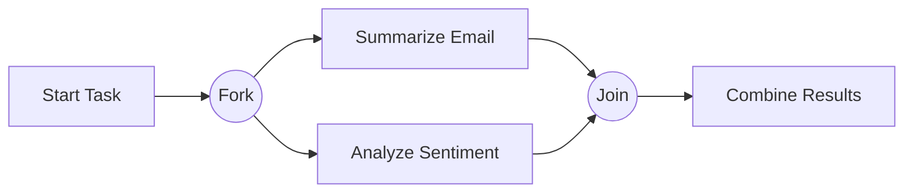


⸻

## 8. Looping (Long running step)

**Kuvaus**
Toistuva silmukka, jossa jokin askel toistetaan yhä uudelleen, kunnes ehto täyttyy.

**Ohje (milloin käyttää)**
Kun halutaan iteratiivinen prosessi (esim. “Kysy uudestaan, kunnes vastaus on hyvä”).

**Esimerkki**
Get Question -> Answer Question -> Kysy “OK?” -> jos ei, palaa alkuun.

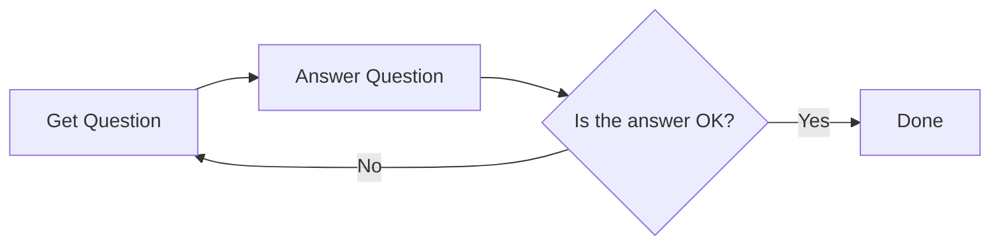


⸻

## 9. Nesting (Reusable step)

**Kuvaus**
Alimoduuli, jota voidaan kutsua useaan kertaan prosessissa.

**Ohje (milloin käyttää)**
Kun jokin tehtävä (esim. “Cooling Task”) halutaan erottaa omaksi kokonaisuudeksi.

**Esimerkki**
“Cooling Task” sisältää vaiheet “Write tests”, “Analyze Complexity”, “Write codes”, “Verify codes”.

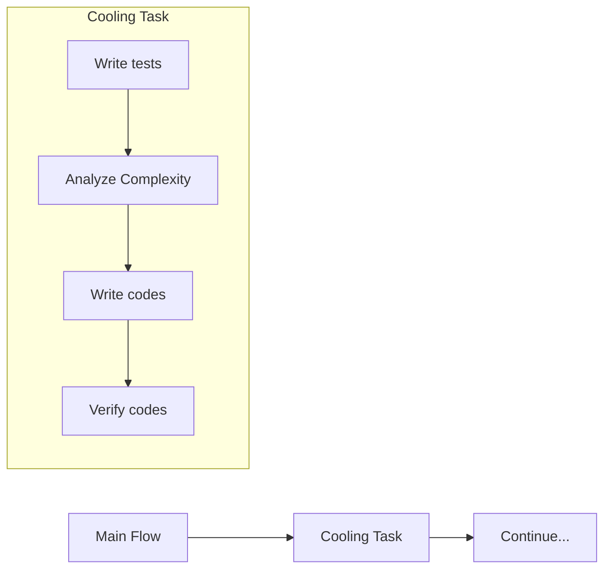


⸻

## 10. Workflow (Directed Path)

**Kuvaus**
Ohjattu polku, jossa tehtävät suoritetaan lineaarisesti määritellyssä järjestyksessä.

**Ohje (milloin käyttää)**
Kun halutaan selkeä ja suoraviivainen alku-loppu -prosessi.

**Esimerkki**
	1.	Summarize Email -> 2) Draft Reply -> 3) Send Reply

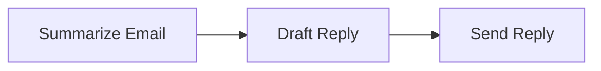


⸻

## 11. CoT (Chain-of-Thought)

**Kuvaus**
Mallin “ajatusketju” tai välivaiheet, joissa se “pohtii” ennen lopullista vastausta.

**Ohje (milloin käyttää)**
Monimutkaisessa päättelyssä, jossa tarvitaan väliaskelia.

**Esimerkki**
	1.	Think -> 2) Tallennetaan think history -> 3) Final Answer

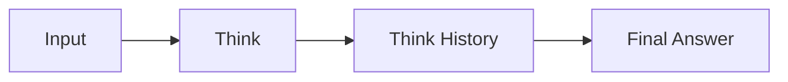


⸻

## 12. Chat (Looping + chat history store)

**Kuvaus**
Chat-pohjainen vuorovaikutus, jossa viestit tallennetaan keskusteluhistoriaan, ja jokainen askel hyödyntää aiempia viestejä.

**Ohje (milloin käyttää)**
Kun toteutetaan keskustelullinen käyttöliittymä (chat) – jokaisella uudella viestillä on historia.

**Esimerkki**
	1.	User Message -> 2) Chat Step -> 3) Chat History

```mermaid
fflowchart LR
    A[User Message] --> B[Chat Step]
    B --> C[Chat History]
    C --> B
```


⸻

## 13. RAG (Retrieval-Augmented Generation)

**Kuvaus**
Mallille annetaan ulkoista tietoa (kuten dokumenttivarasto) vastauksen parantamiseksi.

**Ohje (milloin käyttää)**
Kun halutaan parantaa mallin vastauksia olemassa olevan tietokannan avulla.

**Esimerkki**
	1.	Search Vector DB -> 2) Retrieve Relevant Docs -> 3) Generate Final Answer

```mermaid
fflowchart LR
    A[User Query] --> B[Search Vector DB]
    B --> C[Retrieve Relevant Docs]
    C --> D[Generate Final Answer]
```


⸻

## 14. Map-Reduce (Batch + Merge)

**Kuvaus**
Data pilkotaan pieniin osiin (Map), käsitellään, ja tulokset yhdistetään lopuksi (Reduce).

**Ohje (milloin käyttää)**
Sopii suuren tietomassan rinnakkaiseen käsittelyyn (esim. iso dokumentti palasiksi).

**Esimerkki**
Jaa dokumentti osiin -> Summarize jokainen osa -> Yhdistä yhdeksi tiivistelmäksi.

```mermaid
fflowchart LR
    A[Large Document] --> B[Split into Chunks]
    B --> C[Summarize Chunk]
    B --> D[Summarize Chunk]
    B --> E[Summarize Chunk]
    C --> F[Combine Summaries]
    D --> F
    E --> F
    F[Reduced Summary]
```


⸻

## 15. Chat Memory (Looping + history & vector DB)

**Kuvaus**
Chat-järjestelmä, joka tallentaa jokaisen vuorovaikutuksen paitsi perinteiseen historiaan, myös vektoripohjaiseen kantaan.

**Ohje (milloin käyttää)**
Kun halutaan pitkäkestoista ja älykästä chat-hakua (keskusteluhistorian semanttinen haku).

**Esimerkki**
	1.	Käyttäjän viesti tallentuu chat-historiaan
	2.	Samalla tallennetaan vektori-indeksiin -> helpottaa myöhempää hakua

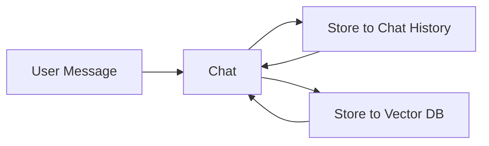


⸻

## 16. Agent (Looping + Branching)

**Kuvaus**
Agentti, joka iteroi tehtävää (esim. Summarize Email) ja haarautuu päätösten perusteella (Need review? Approve?).

**Ohje (milloin käyttää)**
Kun halutaan dynaaminen prosessi, jossa agentti tekee päätöksiä ja palaa tarvittaessa taaksepäin.

**Esimerkki**
	1.	Summarize Email -> 2) Tarvitseeko review? -> 3) Jos ei ok, palaa summarizointiin.

```mermaid
fflowchart LR
    A[Summarize Email] --> B{Need Review?}
    B -- Yes --> C[Review]
    B -- No --> D[Draft Reply]
    C --> E{Approve?}
    E -- Yes --> D
    E -- No --> A
```


⸻

## 17. Multi-Agent (Loop + Branching + pub/sub)

**Kuvaus**
Useita samanaikaisia tai peräkkäisiä agentteja, jotka viestivät toistensa kanssa (publish/subscribe).

**Ohje (milloin käyttää)**
Kun halutaan hajauttaa tehtäviä erikoistuneille agenteille, jotka “kuuntelevat” viestejä ja “julkaisevat” omia.

**Esimerkki**
Agentti A hakee dataa -> julkaisee -> Agentti B lukee -> laatii raportin -> Agentti C lukee -> kommentoi

```mermaid
fflowchart LR
    subgraph Agents
    A[Agent A] -->|publish data| Bus((Pub/Sub Bus))
    B[Agent B] -->|subscribe data| Bus
    C[Agent C] -->|subscribe data| Bus
    end
    
    A --> B
    B --> C
```


⸻

## 18. Supervisor (Nesting, Approve/Reject)

**Kuvaus**
“Meta-agentti” tai valvoja, joka kutsuu useita tehtäviä ja lopuksi hyväksyy tai hylkää niiden tulokset.

**Ohje (milloin käyttää)**
Kun tarvitaan päättävä taho koko prosessin ylle, joka arvioi osatulokset.

**Esimerkki**
Supervisor -> Summarize Email -> Draft Reply -> Lopullinen Approve/Reject

```mermaid
fflowchart LR
    A[Supervisor] --> B[Summarize Email]
    A --> C[Draft Reply]
    B --> D{Supervisor Decision}
    C --> D
    D -- Approve --> E[Done]
    D -- Reject --> A
```
> **Huom:** Voit tallentaa yllä olevan tekstin sellaisenaan `.md`-tiedostona, jonka voit avata tai jakaa eteenpäin.  